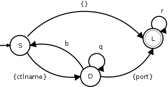

**STATUS:** PRE-ALPHA

### WHAT IS UKRNL.JS?

JS Microkernel emulates the synaptic transmission process between
instances (servers) where the modules are exited with requests, so they
encapsulate, process, and make responses. It is free software (free as
in freedom) under the terms of GPL v3.

### WHAT LANGUAGE IS UKRNL.JS WRITTEN IN?

Written in NodeJS.

### DEPENDS ON

**Screen:** It is not mandatory is well recommended to use a screen to start
	controllers.

### KEYWORDS

**Instance:** This means one virtual or physical server.

**Schema:** This means different user contexts in the same instance sharing
	resources like memory, ports, and descriptors, but if you want
	it keeps different NodeJS versions so it can handle independent
	modules.

**Module:** It can be a user controller or system controller.

**Controller:** It is a standard JS class with private methods, prototypes,
	    constructor and public methods, it supports all class
	    standards like aggregation, inheritance, overload, and so
	    on.

### CONCEPT

The old concept about Database and Programs will change, all data will
be distributed and dispersed for all instances so the writing and
acquisition process flies over the servers.

The controllers will work like programs sometimes, like intermediate
software, and sometimes as data containers. They can be distributed on
many servers, and their responses will match at least many times as
custom level to be valid.

Finally, programs and databases will not exist, just the controller
module accepts requests, and a valid response has to match at least many
times as custom level.

### FACTS

- Each system instance can handle one kernel, so we have lots of kernels
  as instances we have, but at least we must have one kernel in the
  whole system.
  
- Up to 4000 system modules per instance.

- Up to 20,000 user modules per instance.

### LIMITS

Reserved modules/controllers per instance are not defined yet because
Pre-Alpha state.

### CONVENTION USED

All messages between servers, modules, and controllers are JSON
notation.

### SYNAPTIC JS MICROKERNEL TECHNICAL DESIGN



**Nodejs non-native prereqs:**	screen

**Nodejs native prereqs:**	fs http url Math


**Nodejs native calls:**	http.request

```
Postdata:	{
    controller: 'Name',
    method: 'module',
    params: {
        key1: "val1",
        key2: obj2,
        ...
    }
}

Headers:	{
    Content-Type: 'application/json',
    Content-Length: Postdata.length
}

Options:	{
    host: 'IpHost',
    port: PortNumber,
    path: '/lib/ControllerName',
    method: 'POST',
    headers: Headers
}

Returns:	HTTP/1.1 200 OK,
{
    Content-Type: 'application/json'
},
{ return: <value>, data: { object: Object, message:  <desc>  } }
```

### NODEJS CLASS CONVENTION FOR CONTROLLERS

```
module.exports = <ControllerName>;

function <ControllerName>() {};

<ControllerName>.prototype = {
    constructor: <ControllerName>,
    <method0>: function ( objData, oCallBack ) {
        oCallBack( { object: { object: .. }} );
    },
    ..,
    <methodN>: function ( objData, oCallBack ) {
    }
};
```

### SYSTEM AND USER SPACE MODULES (optional)

SYSDB: ukrnl
STATUS: Pre-Alpha
COLLECTION: controller
module		host		id	version			status	path
					major	minor	patch
Processes	localhost	36000	0	0	0	A	/slib/
Init		localhost	36001	0	0	0	A	/slib/
Monitor		localhost	40000	0	0	0	A	/lib/

### UKRNL MODULES / CONTROLLERS JSON DEFS (controllers.json)

```
{
    "module": {
	"Processes": {
	    "host": "localhost", "id": "36000", "status": "A", "path": "/slib/"
	},
	"Init": {
	    "host": "localhost", "id": "36001", "status": "A", "path": "/slib/"
	},
	"Monitor": {
	    "host": "localhost", "id": "40000", "status": "A", "path": "/lib/"
	}
    }
}
```

### UKRNL.JSON (ukrnl.json)

```
{
    "license": " ******************************************************************************\n * Synapses Null Kernel                                                       *\n * Copyright (C) 2014  Victor C. Salas P. (aka nmag) <nmagko@gmail.com>       *\n *                                                                            *\n *  This program is free software: you can redistribute it and/or modify      *\n *  it under the terms of the GNU General Public License as published by      *\n *  the Free Software Foundation, either version 3 of the License, or         *\n *  (at your option) any later version.                                       *\n *                                                                            *\n *  This program is distributed in the hope that it will be useful,           *\n *  but WITHOUT ANY WARRANTY; without even the implied warranty of            *\n *  MERCHANTABILITY or FITNESS FOR A PARTICULAR PURPOSE.  See the             *\n *  GNU General Public License for more details.                              *\n *                                                                            *\n *  You should have received a copy of the GNU General Public License         *\n *  along with this program.  If not, see <http://www.gnu.org/licenses/>.     *\n ******************************************************************************\n",
    "version": {
	"major": 2,
	"minor": 0,
	"patch": 0
    },
    "debug": 1,
    "allow_cors": 0,
    "default_binding_port": 4000,
    "collection": [
	"multiplexer",
	"controller"
    ]
}
```

### FREE DOCUMENTATION LICENSE

Copyright (C)  2015,2016  Victor Clodoaldo Salas Pumacayo.

  Permission is granted to copy, distribute and/or modify this document
  under the terms of the GNU Free Documentation License, Version 1.3
  or any later version published by the Free Software Foundation;
  with no Invariant Sections, no Front-Cover Texts, and no Back-Cover Texts.
  A copy of the license is included in the section entitled "GNU
  Free Documentation License".
